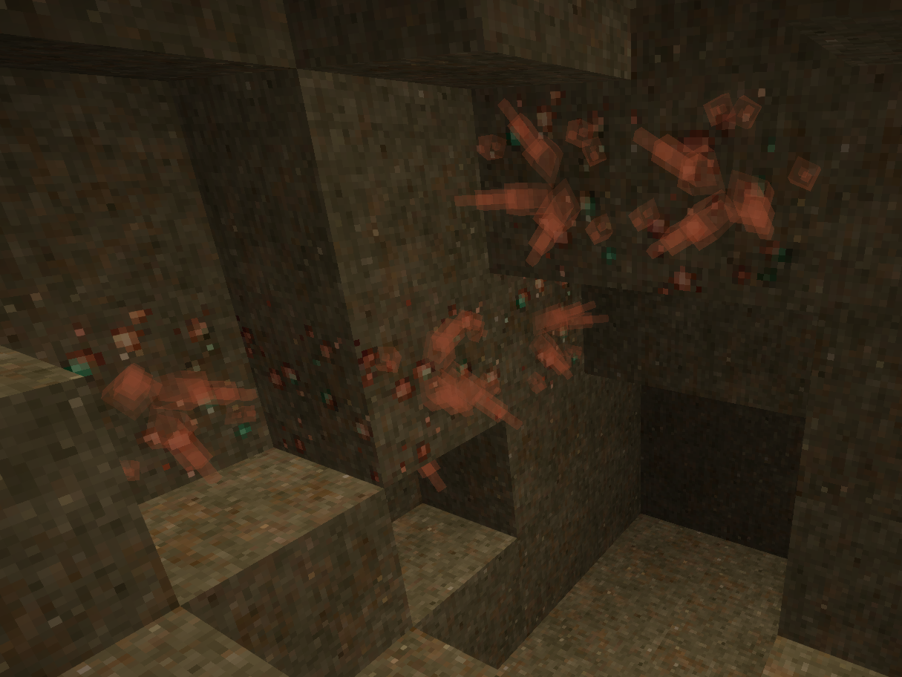

## Ore Crystals

What's that faint glow in the distance...? Is it a way out of this cave? Is it something more sinister? 

No. It's strange, crystallized metal growing from this ore... Huh. Maybe those temporal storms we've been having have something to do with it?

### Description

Welcome to the GitHub repository for the Vintage Story mod, Ore Crystals! 

This is a relatively simple quality of life/visual mod that makes cave exploring a little more exciting and makes those ores a little more noticable!
This mod adds crystals to the worldgen, growing out the sides of any vanilla ore blocks with a surface open to air. They may be fragile, glass-like structures with no material value at all...
but they glow all pretty-like!

### Releases

### Vintage Story 1.13.0+

[Version 1.1.4](https://github.com/TaskaRaine/Ore-Crystals/releases/download/v1.1.4/orecrystals_v1.1.4.zip)

#### Vintage Story 1.12.6+

[Version 1.1.3](https://github.com/TaskaRaine/Ore-Crystals/releases/download/v1.1.3/orecrystals_v1.1.3.zip)

[Version 1.1.2](https://github.com/TaskaRaine/Ore-Crystals/releases/download/v1.1.2/orecrystals_v1.1.2.zip)

[Version 1.1.1](https://github.com/TaskaRaine/Ore-Crystals/releases/download/v1.1.1/orecrystals_v1.1.1.zip)

[Version 1.1.0](https://github.com/TaskaRaine/Ore-Crystals/releases/download/v1.0/orecrystals_v1.1.0.zip)

[Version 1.0.0](https://github.com/TaskaRaine/Ore-Crystals/releases/download/v1.0/orecrystals_v1.0.0.zip)

### Changelog

##### Version 1.1.4
Mod updated to be compatible with Vintage Story 1.13

##### Version 1.1.3
Ore Crystals is now being released as DLL mod which should solve the error where VSSurvival could not be found as a dependency when the mod is loaded on a dedicated server.

##### Version 1.1.2
Implemented the '/cleanworld' command. This can be used to revert the ? blocks that the mod created due to incorrect crystal IDs. 

##### Version 1.1.1
Fixed an issue where incorrect crystal IDs were used during world generation when the mod was added to existing worlds.

##### Version 1.1.0
Increased texture opacity of crystals to make them slightly more visible

##### Version 1.0.0
Initial Release
