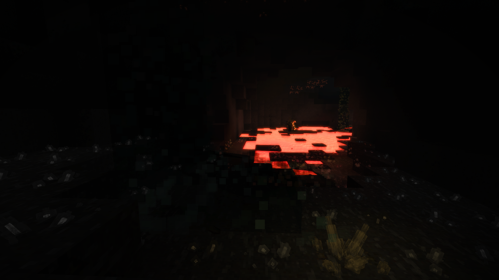

## Ore Crystals

What's that faint glow in the distance...? Is it a way out of this cave? Is it something more sinister? 

No. It's strange, crystallized metal growing from this ore... Huh. Maybe those temporal storms we've been having have something to do with it?

### Description

Welcome to the GitHub repository for the Vintage Story mod, Ore Crystals! 

This is a relatively simple quality of life/visual mod that makes cave exploring a little more exciting and makes those ores a little more noticable!

This mod adds crystals to the worldgen, growing out the sides of any vanilla ore blocks with a surface open to air. They are fragile structures that have a chance to break into shards which can then be used to craft various crystal-based blocks.

### Releases

### Vintage Story 1.15.0+
[Version 1.3.0](https://github.com/TaskaRaine/Ore-Crystals/releases/download/1.3.0/OreCrystals_V1.3.0.zip)

### Vintage Story 1.13.0 - 1.14.0+
[Version 1.2.2](https://github.com/TaskaRaine/Ore-Crystals/releases/download/1.2.2/OreCrystals_v1.2.2.zip)

[Version 1.2.1](https://github.com/TaskaRaine/Ore-Crystals/releases/download/1.2.1/orecrystals_v1.2.1.zip)

### Vintage Story 1.13.0+

[Version 1.2.0](https://github.com/TaskaRaine/Ore-Crystals/releases/download/1.2.0/orecrystals_v1.2.0.zip)

[Version 1.1.4](https://github.com/TaskaRaine/Ore-Crystals/releases/download/v1.1.4/orecrystals_v1.1.4.zip)

#### Vintage Story 1.12.6+

[Version 1.1.3](https://github.com/TaskaRaine/Ore-Crystals/releases/download/v1.1.3/orecrystals_v1.1.3.zip)

[Version 1.1.2](https://github.com/TaskaRaine/Ore-Crystals/releases/download/v1.1.2/orecrystals_v1.1.2.zip)

[Version 1.1.1](https://github.com/TaskaRaine/Ore-Crystals/releases/download/v1.1.1/orecrystals_v1.1.1.zip)

[Version 1.1.0](https://github.com/TaskaRaine/Ore-Crystals/releases/download/v1.0/orecrystals_v1.1.0.zip)

[Version 1.0.0](https://github.com/TaskaRaine/Ore-Crystals/releases/download/v1.0/orecrystals_v1.0.0.zip)

### Changelog

#### Version 1.3.0
Major update to Ore Crystals which features new harvesting and crystal farming mechanics, along with new blocks and items!

##### Major Changes
Crystals of any varienty can now only be harvested by using a chisel or pickaxe. Chisel harvesting yields more crystal.

Only crystal seeds can be crafted. All other variants are not craftable. 

##### New Things

Added a multiblock obelisk structure to the worldgen that will spawn once in each chunk if 2x2 ore blocks have an upper face open to air. 

Obelisks spawn a new entity whenever a player nears called a Crystal Heart. It is guarded by three Crystal Locusts, a new locust variant, with a new AI behaviour. It will charge at the nearest player whenever its health drops below a threshold and embed itself in the ground before exploding into shards of crystal.

Cores can be carved from hearts using a knife and crafted into different variants of heart.

Crystal Seeds can now be crafted by the player, replacing all other previously craftable crystals. They are used in conjunction with Crystal Hearts to grow crystal.

Crystal Arrows can be crafted with the rare Luminous Rod. They can be used to light up a dark cave from a distance, or as a normal arrow. 

Planter Crystal decorations. Ore placed within a planter and surrounded by crystal, a much larger variant of the potted crystal.

Crystal Grenades. Take your favourite crystal heart, shove a whole bunch of crystal shards into it, and watch it deal massive amounts of damage as it explodes into tiny shards of crystal. 

#### Version 1.2.2
Minor worldgen tweak that prevents crystals from stealing spaces in the new underwater lakes for VS 1.14.3.

#### Version 1.2.1
Mod objects are now better organized within the handbook.

#### Version 1.2.0
Ore crystal textures have been updated.

Ore crystals now act as a faint light source and have been given a reflective shader. These changes are only visible on newly generated crystals.

Ore crystals now have a chance to drop a new item called Crystal Shards. 

All variations of ore crystals can now be crafted with shards and placed in world.

Crystalline Glass has been added, a frosty stained glass block for each crystal variant.

Potted Crystals have been added.

#### Version 1.1.4
Mod updated to be compatible with Vintage Story 1.13

#### Version 1.1.3
Ore Crystals is now being released as DLL mod which should solve the error where VSSurvival could not be found as a dependency when the mod is loaded on a dedicated server.

#### Version 1.1.2
Implemented the '/cleanworld' command. This can be used to revert the ? blocks that the mod created due to incorrect crystal IDs. 

#### Version 1.1.1
Fixed an issue where incorrect crystal IDs were used during world generation when the mod was added to existing worlds.

#### Version 1.1.0
Increased texture opacity of crystals to make them slightly more visible

#### Version 1.0.0
Initial Release
